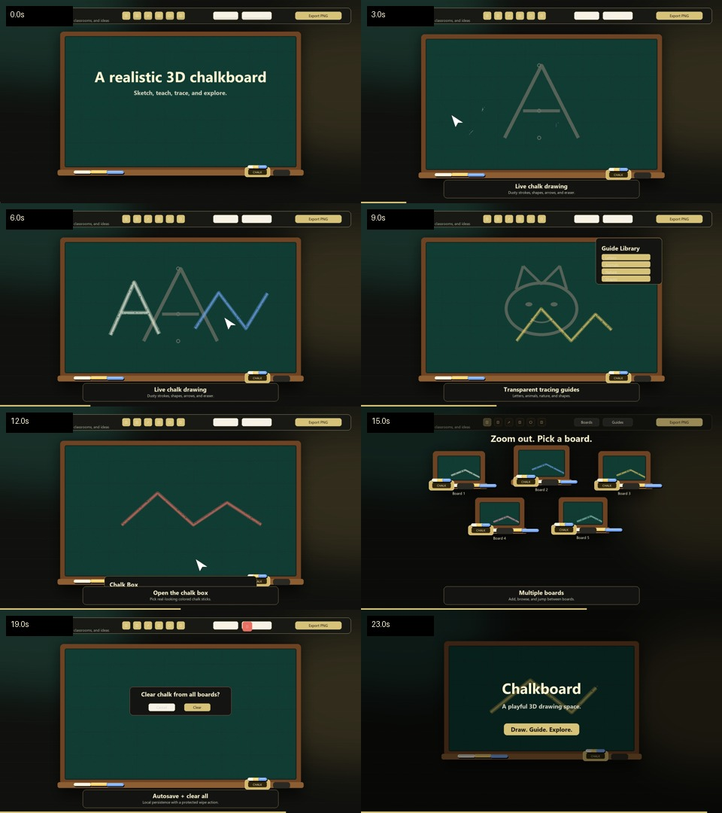

# Chalkboard

A realistic 3D chalkboard sketching tool built with Three.js.



The app maps a high-resolution drawing canvas onto a physically lit 3D board, so chalk strokes stay responsive while the workspace keeps depth, frame shadows, a tray, chalk sticks, and subtle camera parallax.

## Features

- Freehand chalk with dusty grain and jittered texture
- Chalky line, arrow, rectangle, and oval tools
- Eraser, undo, redo, clear, and PNG export
- Adjustable chalk color, size, and dust amount
- Browser and Electron support

## Development

```bash
npm install
npm run start:web
```

Open the printed local URL in a browser.

For the desktop shell:

```bash
npm start
```

## Packaging

```bash
npm run build:win
npm run build:mac
```

Builds are configured through `electron-builder`. macOS builds should be produced on macOS for normal signing and notarization workflows.
